# 1.プロジェクト及びコンテナの作成と動作の確認

## 1-1.プロジェクトの作成
 OpenShiftは、”プロジェクト”　単位でアプリケーションや権限などを管理しています。  
 アプリケーションを作成するにはまずプロジェクトを作成します。  
   
### ***1-1-1. OpenShift のWebコンソールにログインし、"New Project" をクリックします。***  

     
   　　   　※Webコンソールのアドレス、ログインIDとパスワードは別途ご確認ください。  
           
### ***1-1-2. Name欄に、"nexus-your-name"を入力し、Createをクリックします。***  
 ※プロジェクト名は一意ある必要がありますのでご注意ください。
  
   
  
## 1-2.コンテナのデプロイメント
プロジェクト内にアプリケーションを作成してみます。  

### ***1-2-1. Deploy Imageをクリック。***

### ***Image Name 欄に、”sonatype/nexus3”を入力の上、右端の*** 🔍 ***アイコンをクリックし、次に、Deployをクリックします。***

※Sonatype が提供するDockerレポジトリからのコンテナ取得を行っています。また、詳細パラメータでは、コンテナに独自の構成情報を付加する「環境変数」と、リソースをグループ化し、アクセス制限など細かな制御を実現する「ラベル」の設定が可能であることを確認します（今回は設定しません）。
  　
  　
  　
### ***1-2-2. プロジェクト名をクリックします。***
　


### ***1-2-3. 上下の矢印をクリックし、Podが増減することを確認します。***
「Project」の「Overview」ページが開きます。「Nexus3」というサービスが作成され、Podが1つデプロイされていることが分かります。  
  
　
  

### ***1-2-4. Create Routeをクリック(上図参照)し、「Nexus3」サービスに対するルートを作成します。***

 　
※コンテナをデプロイするだけでは外からの接続が行えません。
　ルート作成では、以下のようなオプションが設定可能です。（今回は指定しません）

HostName：アプリケーションのDNS名を指定（指定しない場合は自動で作成）  
Path：サービスへの追加URL（サブディレクトリ）  
Target Port：ネットワークポートの指定  
Security：  TLSターミネーションタイプの変更
  
### ***1-2-5. サービスへのルートが作成されました。クリックしてみます。***
  
 　

Nexusリポジトリマネージャーが起動し、接続できることを確認します。サインインに関しては以下のアカウントが利用可能です。

admin/admin123

※サービスが完全に立ち上がるまでに少し時間がかかります。もし接続できないときは、少し時間をおいて確認してみましょう。


### ***1-2-6. 動作が確認できたら、、ホームページに戻り、プロジェクトを削除します。***


## 2.使用リソースの確認
　新しくアプリケーションをデプロイし、そのアプリケーションが使用しているCPUやメモリリソースについて確認してみましょう。

### 2-1.テンプレートの利用とリソースの確認
　### ***2-1-1. まずはプロジェクトを作成します。***


### ***2-1-2. 名前を入力し、「Create」をクリックします。
※名前はご自由に入力ください。但し、OpenShif内で一意である必要があります。

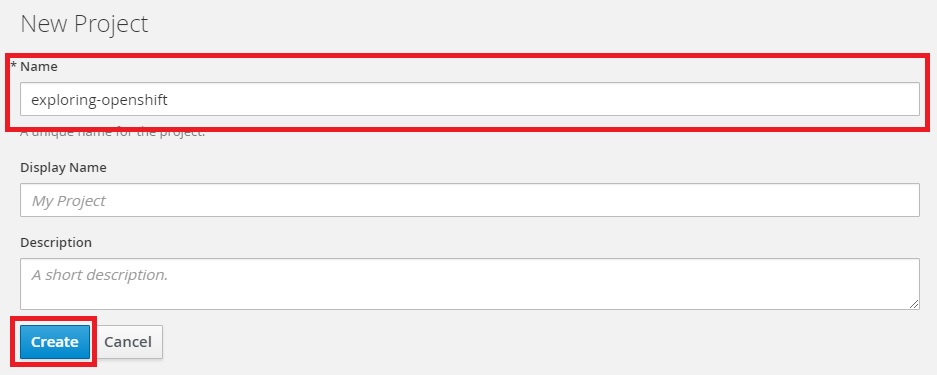

### ***2-1-3. 今度はテンプレートからデプロイしてみます。検索画面で、"cakephp" を入力。CakePHP +MySQL　の「Ephemeral」を選択します。***


### ***2-1-4. 以下を確認の上、一番下の「Create」をクリックし、デプロイを開始します。***

サービス名、PHPとMySQLコンテナがそれぞれ利用可能な、最大メモリの値、アプリのソースコードが含まれるGitリポジトリが指定できることを確認します。


さらに、データベースのユーザーやパスワード等の設定やラベルをここで定義できることを確認します。指定しない場合は、自動的に作成されます。これらの値を利用して、フロントエンドのアプリケーションとバックエンドのデータベースのデプロイを行います。

プロジェクトをクリックし（図なし）、Overview で、以下を確認します。  
- Podが二つデプロイされていること  
- ルートが既に作成されていること  
- Build状態を確認するためのリンク  
- サービスへのリンク  
※作成には少し時間がかかります。Pod作成の完了は、Pod数 1 になっていることを確認しましょう。  
　さらに、レプリカの数の増減が出来ること、リソースの消費量が確認できます。


※リソースが表示されない場合は以下を確認しブラウザのアクセス制限を解除下さい。

「Applications」→「Pods」を選択。
「cakephp-xxxx...」をクリックし、「Metrics」をクリック
ブラウザのセキュリティを解除してください

 

   

「Metrics」がそもそも表示されないケースもあるようです。その際は、まず、以下にアクセスし、
MetricsServiceがStartになっていることを確認の上、master 1/2/3をリブートしてみてください。

### 2-2.サービスとビルドの確認
　今作成したアプリケーションに関するサービスとビルドについて詳細を確認してみましょう。
 「Application」→「Services」をクリック。


「mysql」サービスをクリック。


ルート、ポッドなどを確認することができます。


次に、ビルド情報を見てみます。
「Builds」→「Builds」を選択。ここにはプロジェクト内のすべてのビルド、及びそのステータス、ソースへのリンク、デプロイがいつ行われたかなどが表示されます。一通り確認が終了したら、「cakephp-xxxx...」をクリック。


右上の「Start Build」をクリックしてみましょう。
#2が追加されることが分かります。#1、#2をクリックして内容を確認してみます。


こちらは#1の表示例です。以下を確認します  
・「Rebuild」のクリックで再ビルド実行可能  
・ビルドのステータスとトリガー理由  
・ソース情報  
　など  
「Logs」をクリックします。


ソースコードリポジトリがコンテナ用にダウンロードされていることが分かります。一番下の方を確認すると、完了したイメージがプロジェクト名を追加されてレジストリに追加されていることが分かります。


「アプリケーション」→「Deployments」で何が見えるか確認してみます。


cakephp-mysql-exampleの方は、先ほどデプロイしましたので、LastVersionが＃2となっています。また以下の情報が取得できることを確認します。  
  
・それぞれのPodのレプリカ数  
・いつ作成されたか  
・作成されたきっかけ  
  


一通り確認ができたら、cakephp-mysql-example　行の「#2」をクリックします。右上の「Actions」をクリックし、以下の確認・設定等が行えることを確認します。  

・デプロイに利用されたテンプレート情報  
・オートスケール
・リソースのリミット
・ポート情報  
・メモリ制限  
・永続ボリュームが追加可能  


「Environment」タブをクリックします。
デプロイ時に設定された環境変数が確認できます。環境変数はPod内で、ユーザー名やデータベース名など様々なパラメーターを設定することが可能で、また、ユーザー自身での追加も可能です。
確認が終了したら、「Events」タブをクリックします。


デプロイに関する様々なイベントを確認できます。一連の作業内容の確認や、デプロイの際のトラブルの確認などに利用可能です。


### 2-3.Podの確認
次にPodの確認を行ってみましょう。
「Applications」→「Pods」をクリックします。


プロジェクト内で有効なPodが表示されることを確認します。「Completed」、「Running」などのステータスが確認できます。Podの一つをクリックします。

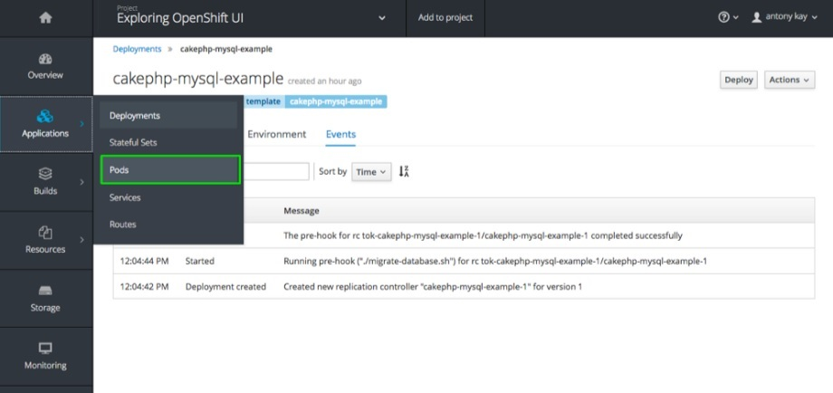

「Details」タブで以下が確認できます。  
・Podの状態  
・ホストするOpenShiftノード  
・イメージ  
・ビルド（#含む）  
・CPU、メモリの利用範囲  
・永続ストレージの追加  
　など。  
確認が終わったら、「Metrics」タブをクリックします。  


メトリックスタブにはPodで使用されるリソースが表示されます。
・利用可能な最大メモリと、実使用量  
・利用可能な最大CPUと実使用量  
・ネットワーク使用量も表示されます  

一通り確認したら、「Logs」タブをクリックします。


View Archive をクリックすると、Kibanaログシステムに接続できます。ここでは、過去から現在まで、全てのPodのログを表示できます。
「Terminal」タブをクリックします。


ターミナルでは、Podの中のいずれかのコンテナ内のターミナルを利用できます。

「Event」をクリックします。


「Event」タブでは、Podに関するイベントが表示されます。


### 2-4.ルートの確認
次にルートの確認を行ってみましょう。
「Applications」→「Services」をクリック。
プロジェクトに関連する全サービスが表示されます。  
・クラスタIP  
　サービスに接続するためのIPアドレス  
・ポート  
　サービスが待機しているポート番号  


「Applications」→「Routes」をクリックし、ルートが表示されることを確認します。


## 3.クォータの設定と確認 (03 02)
一つのプロジェクトがリソースを食いつぶしてしまわないよう、プロジェクトにはクォータの設定が可能です。プロジェクトの管理者・利用者はあらかじめ定められたリソース内でリソースを利用することが可能です。


まだクォータが設定されていないので、何も表示されません。このプロジェクトに対し、クォータを設定してみます。  


クォータの設定はコマンドラインから行います。sshクライアントで、Workstation 環境に接続します。
　※接続先等は別途ご確認ください。


    $ oc login <OpenShift Master1 IP>
    　login ID:andrew
      Password:r3dh4t1! 

    $ oc login <OpenShift Master1 IP>


クォータでは、以下が確認できます。  
・このプロジェクトと全プロジェクトの利用CPU/メモリ  
・このプロジェクトと全プロジェクトに設定されているクォータ  
・Pod、サービスの数など  

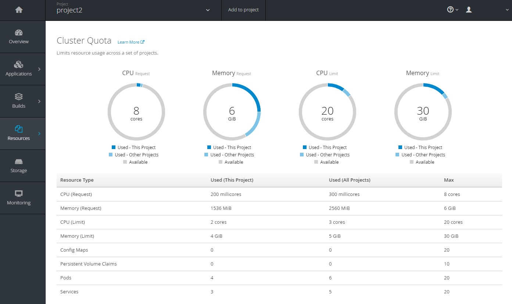

クォータの効果を確認するため、「Overview」をクリックし、Podを7に増やします。


クォータに戻ります。Pod数が増えていること、クォータ制限にかかりそうなリソースが一目瞭然であることを確認します。クラスタ管理者が設定したポリシーに従って、プロジェクトごとにクォータ設定が与えられ、ユーザーはそのクォーター内でデプロイが可能です。
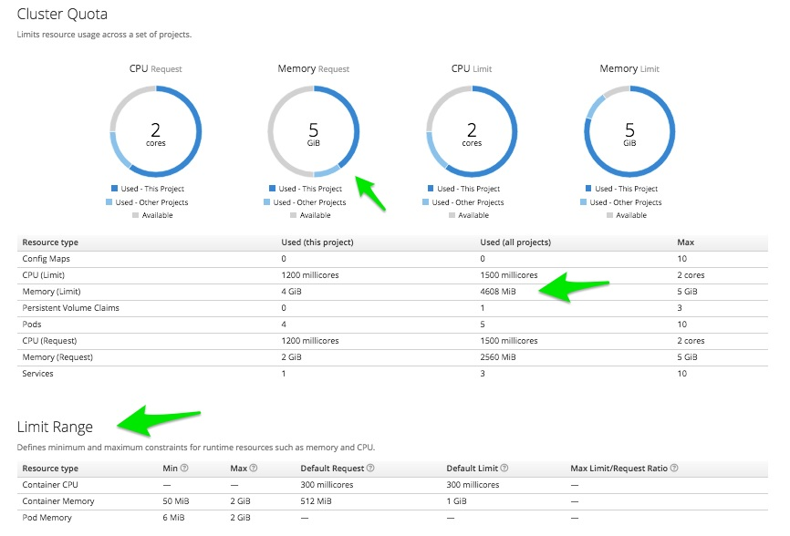

終了したら、、ホームページに戻り、プロジェクトを削除します。


## 4.ログとメトリックスの収集 (03 03)
アプリケーションをデプロイし、メトリックスの収集と表示、ログ表示について学びます。

### 4-1.テキストログの確認
新規にプロジェクトを作成します。
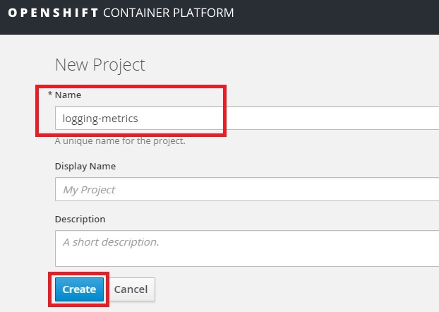

"eap64" を入力し、「jboss-eap-openshift」を選択します。
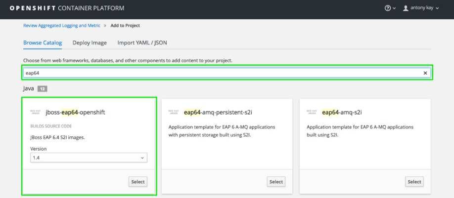

以下を入力して作成します。
S2Iであることも確認しておきます。
Name:
 openshift-tasks
Git Repo:  https://github.com/openshiftdemos/openshift-tasks

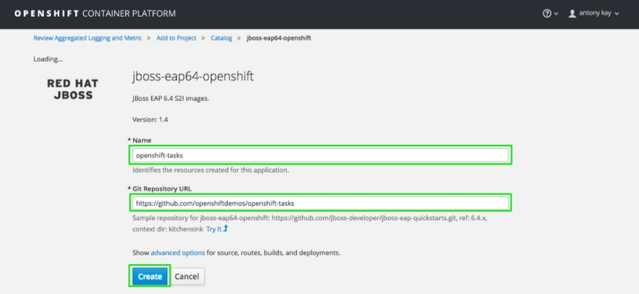

Continue to overviewをクリックし、Overview画面を表示させます。
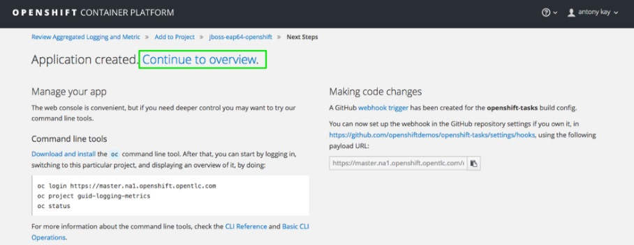

自動的にルートが作成されていることを確認し、「View Log」をクリックします。
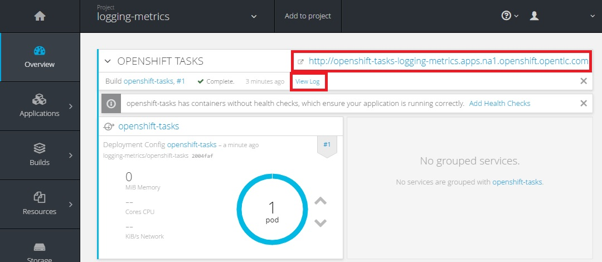

最終行を追いたい時には、「Follow」、特定の位置で止めたい場合は、「Stop Following」を選択
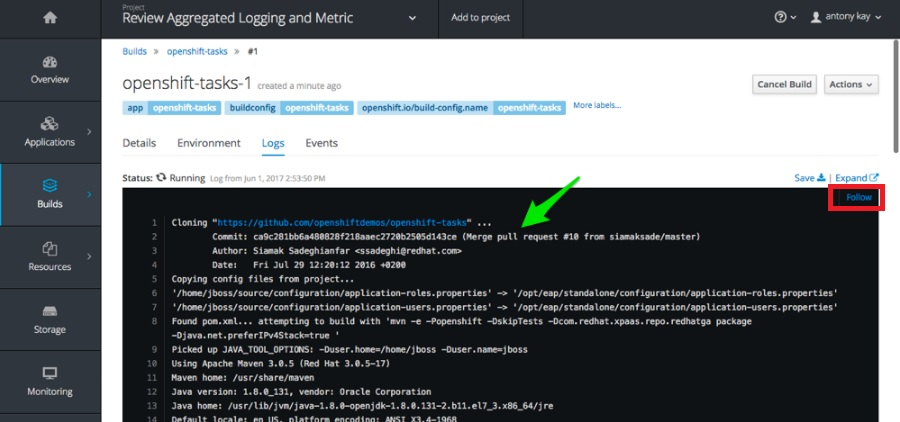

ソースコードがダウンロードされ、イメージが作成されていることを確認します。
後のデプロイメントに利用するためのデータもコピーされていることが分かります。これは、例えば、Jenkins Server上のMavenビルドなど、他の場所で実行された場合でも作成されます。確認終了後、「Overview」を表示します。

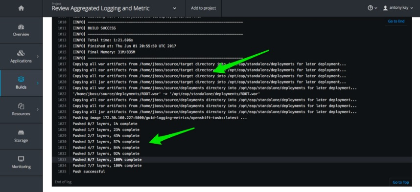

### 4-2.メトリックスの確認とKibanaを利用したLogの閲覧
ロードジェネレーターを利用して、CPUに負荷をかけ、その様子を確認してみましょう。
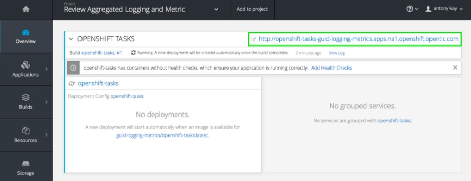

値（負荷発生時間）に300を入力し、「Load」をクリックします。

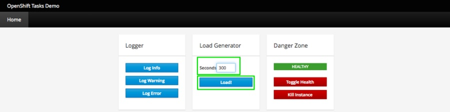

「Overview」をクリックし、CPUに負荷がかかっていることを確認します。
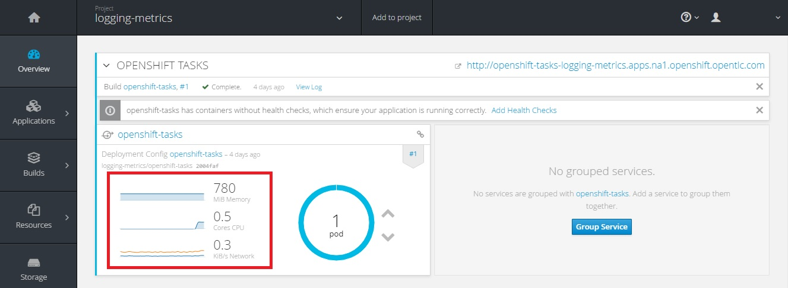

アプリケーション実行中のPodをクリックします。
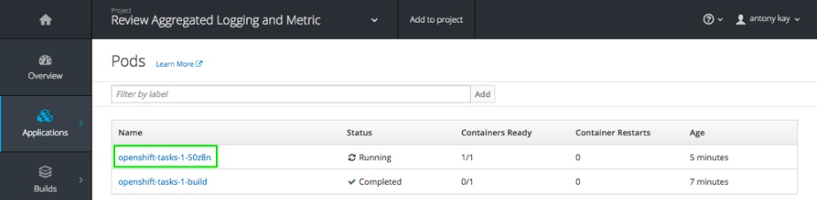

「Metrics」タブをクリックします。
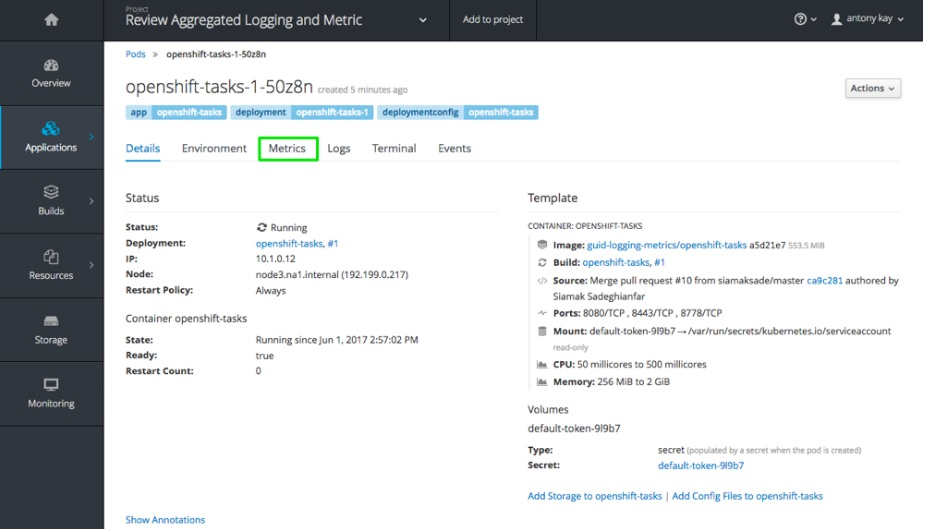

Podで使用されているMemory、CPU、Networkのリソース利用量が表示されることを確認します。ロードジェネレーターを起動させたので、CPUの負荷が一時的に上がっていることが分かります。
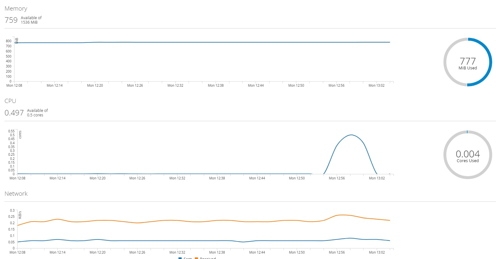

アプリケーションページに戻り、「Logger」にある各Logを数回クリックし、メッセージを生成します。

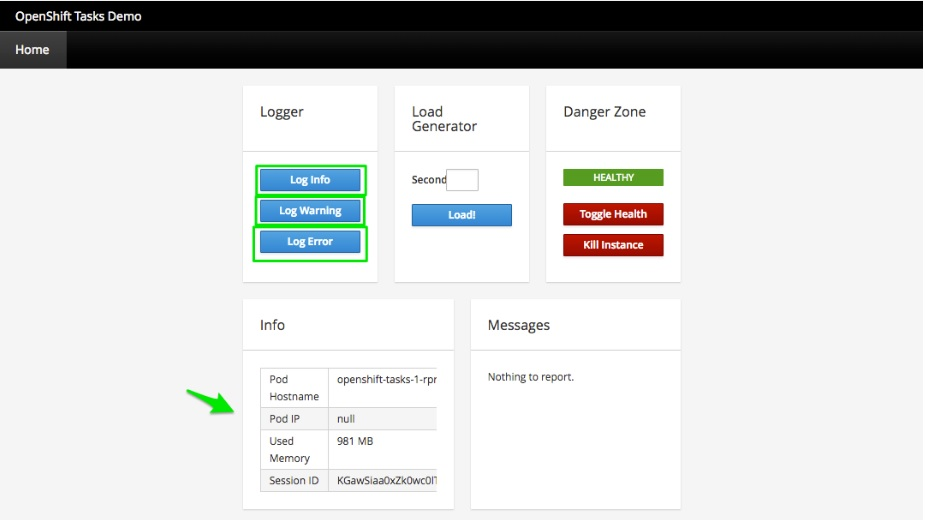


「Overview」で、Podを3Podsに増やします。
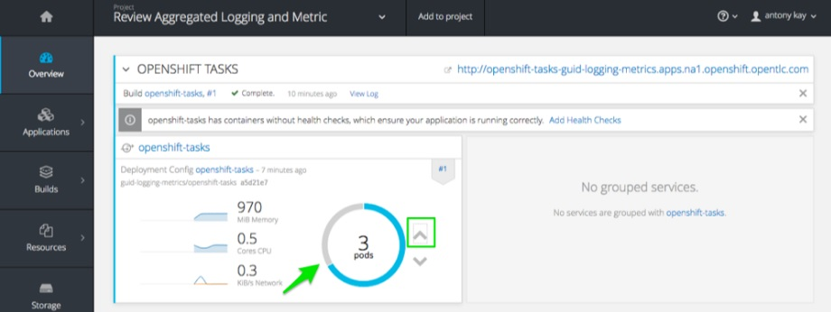


3つのPodのうち、一つをクリックします。
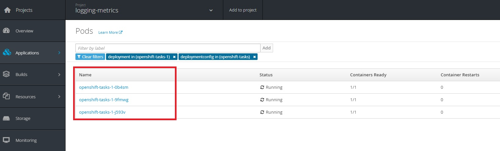

「Logs」タブをクリックします。Kibanaを使ってLog内容が表示されています。Kibanaでは、実行中・停止中にかかわらず全てのPodのLog情報が閲覧可能です。「View Archive」をクリックします。

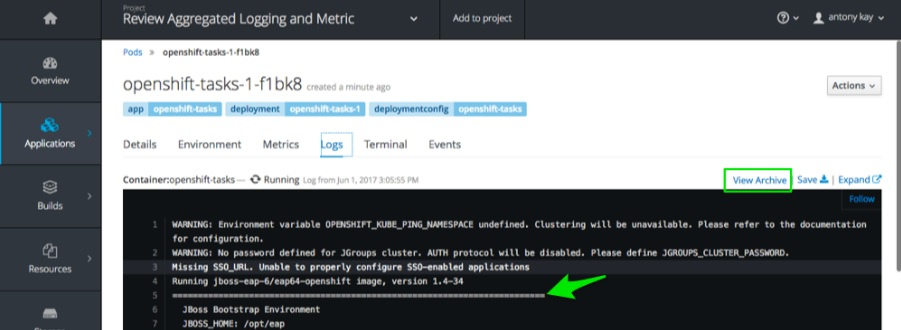

上部フィールドには、特定のPodを示すフィルターが入力されていることを確認します。また、下部には、メッセージが表示されていることを確認します。

※環境依存でうまく動かないケースもある様です。うまくいかない場合は、6.に進んでください。


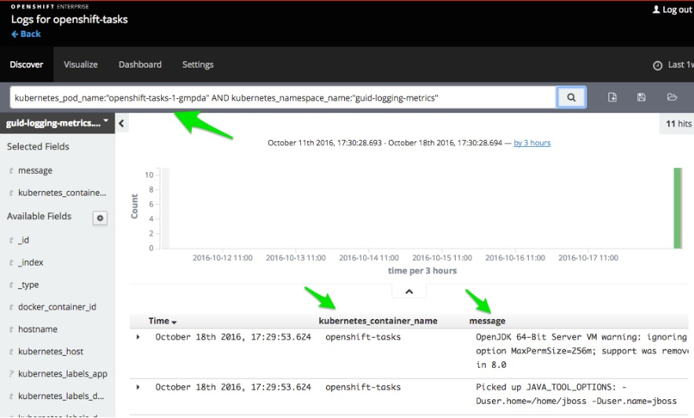

フィルターの最初の部分を削除して、プロジェクト内すべてのPodを表示します。


さらに、*error*を最後に追加して、全エラーメッセージが表示される様にします。

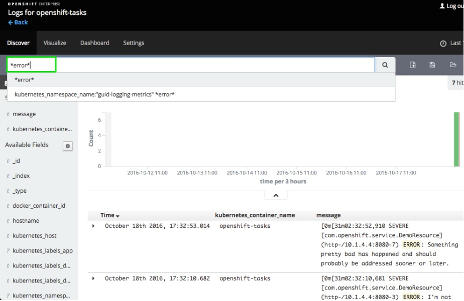

確認が終了したら、、ホームページに戻り、プロジェクトを削除します


## 5.環境変数の設定と確認 (03 04)
アプリケーション作成の際に環境変数を設定し、コンテナに設定が反映されることを確認してみましょう。
　新しくアプリケーションをデプロイし、そのアプリケーションが使用しているCPUやメモリリソースについて確認してみましょう。

### 5-1.環境変数の設定と動作の確認
　まずはプロジェクトを作成します。


### ***「New Project」をクリックします。***

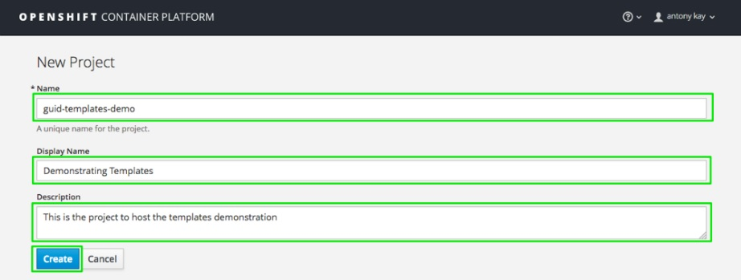
### ***名前を入力し、「Create」をクリックします。***

※名前はご自由に入力ください。但し、OpenShif内で一意である必要があります。

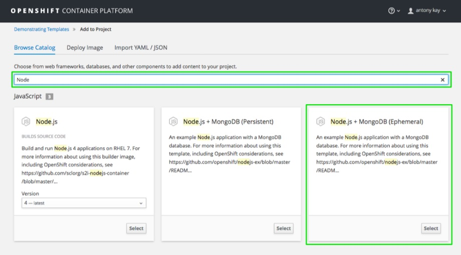
### ***テンプレートの選択画面で、"Node"と入力し、Node.js + MongoDB (Ephemeral)を選択します。***

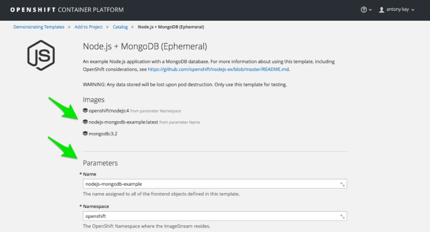

(確認のみ)このテンプレートをデプロイするために利用されるイメージが表示されています。

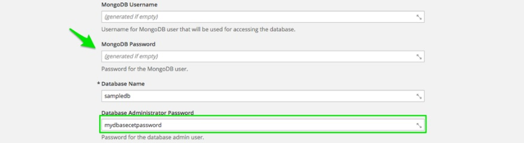
### ***下にスクロールし、環境変数として「Administrator Password」欄に適当なパスワードを入力してみましょう。入力がすんだら、「Create」をクリックします。***

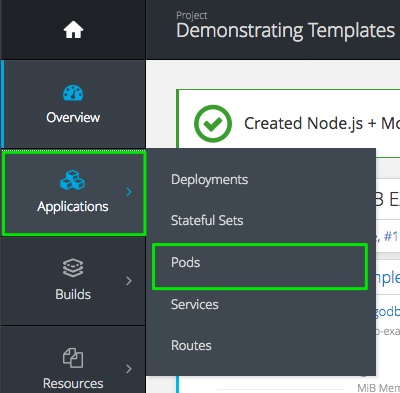
### ***「Applications」→「Pods」をクリックします。***


### ***nodejs-mongodb-example-xxxをクリックします。***


### ***Terminalタブを開き、echo $MONGODB_ADMIN_PASSWORDを入力し、デプロイ時に設定したパスワードが表示されることを確認します。
さらに、以下のコマンドで、OpenShiftが自動生成したパスワードも確認します。  
### ***echo $MONGODB_PASSWORD***


以下のコマンドを入力してみます。
### ***ls***  
### ***ps -ef***
　コンテナ内のプロセス確認
### ***env |grep -i mongo***
　環境変数の確認
### ***cat /etc/resolv.conf***
　DNS設定の確認

確認が終了したら、ホームページに戻りプロジェクトを削除します。  


## 6.環境変数によるアプリケーションの動作と再デプロイ (04 01)
異なるアプリケーションの動作を環境変数によって実現してみましょう。また、構成変更した後にアプリケーションの再デプロイを行い、その動きについて確認してみます。

### 6-1.環境変数の設定と動作の確認
　まずはプロジェクトを作成します。

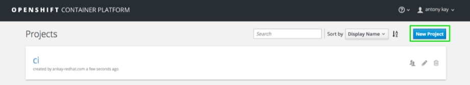
### ***「New Project」をクリックします。***

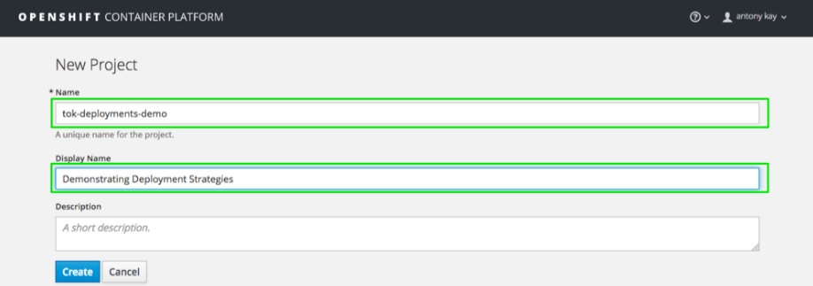
### ***名前を入力し、「Create」をクリックします。***

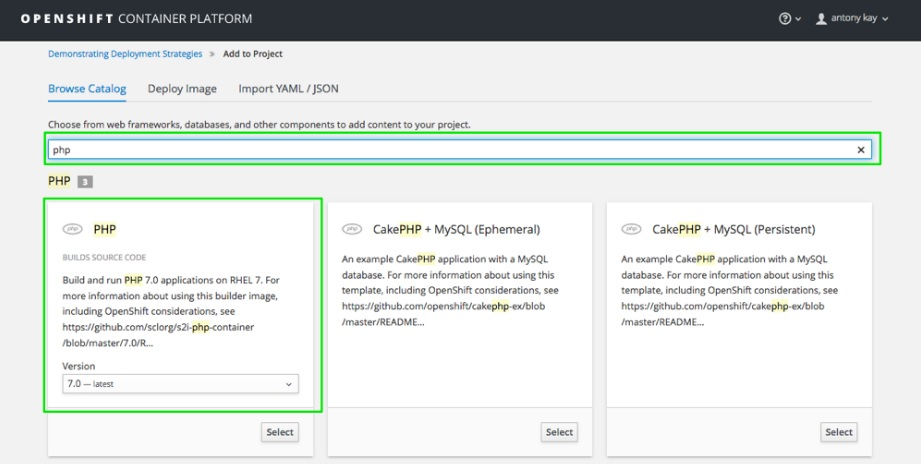
### ***カタログ選択画面で、"php"を入力し、PHPを選択します。***


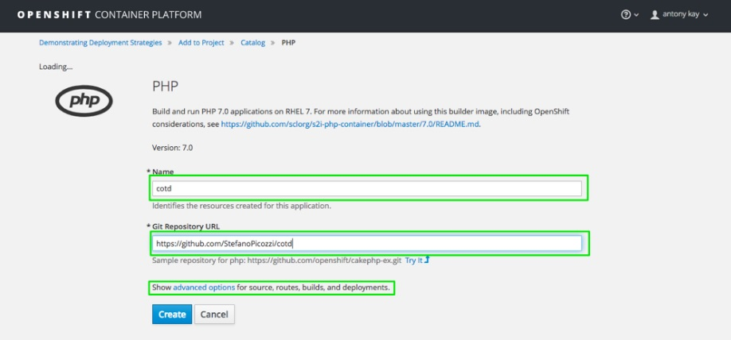
### Name欄に、"cotd"、GitURLに、https://github.com/StefanoPicozzi/cotd を入力。さらに、「advanced options」をクリックし、下の方へスクロールします。***


### ***Deployment Configurationsセクションで、環境変数として、"SELECTOR cities" を入力します***

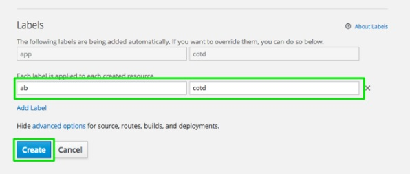
### さらに、Labelsセクションで "ab cotd" を設定します。入力が終了したら、「Create」をクリックします。***

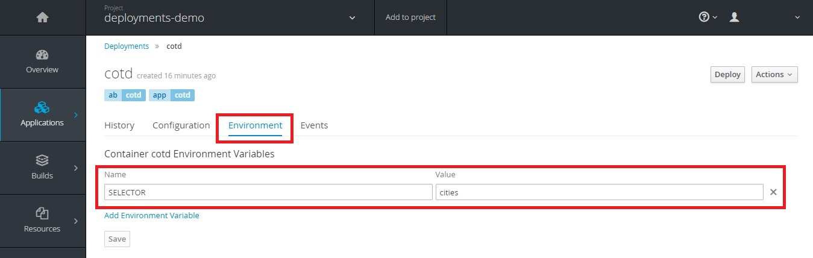
（確認のみ）アプリケーションの環境変数が期待通りに設定されていることを確認します。この環境変数により、Webアプリケーションで表示される写真が変わります。今回設定したのは、「街」の写真です。


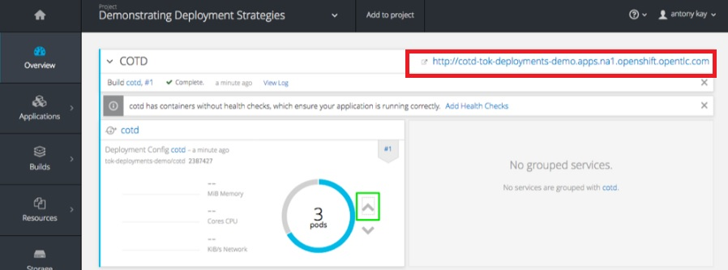
### ***「Overview」で、アプリケーションのルートをクリックします。***  
アプリケーションがデプロイされていること設定した環境変数により、「街」の写真が表示されることを確認します。
### ***さらに、Podアイコン右側の上矢印を2度クリックし、3Podにスケールアップします。***

### 6-2.アプリケーションの再デプロイ
作成したアプリケーションを再デプロイしてみます。


### ***「Applications」→「Deployments」をクリックします。***


### ***「Deploy」をクリックしすぐに「Overview」をクリックします。***
新しいPodが必要なレプリカ数（今回の場合3個）になるまで増え、逆に、旧Pod新Podが作成される度に1つずつ削除されることを確認します。
この様に、Podはローリングアップデートされます。


### ***「Overview」から、アプリケーションへのショートカット、「cotd」をクリックします。***


### ***「Environment」タブで、「deployment configuration」をクリック。環境変数の値を、”cats”に変更し、Saveします。***
### ***すぐに、「Overview」に戻り、Podが再デプロイされていることを確認します。***
### ***さらに、アプリケーションへのリンクをクリックし、先ほどの「街」ではなく、「ネコ」が表示されることを確認します。***


### ***再度アプリケーションへのショートカットをクリックします。***


### ***「Configuration」タブを表示させ、StrategyがRollingであることを確認。その後、「Actions」から、「Edit YAML」をクリックします。
※オートスケーラーやストレージの追加、リソース制限等もこちらから設定可能であることを確認します。

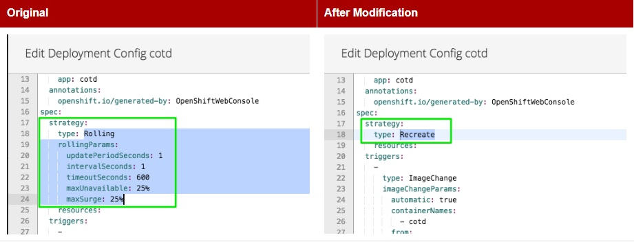
### ***上記の例に従って、Strategy の中を編集し、保存します。***


### ***「Deploy」をクリックし、「Overview」を表示します。


（確認のみ）Recreateに変更したことにより、レプリカのすべてが0にスケールダウンされた後、新しいPodがデプロイされることを確認します。表示上の時間が短く分かりにくい点もありますが、上記のように推移します。

## 7.アプリケーションのライフサイクル管理
Jenkinsを使ったアプリケーションライフサイクルの管理を行います。  
このラボは、コマンドラインを多用しますので、SSHで接続できることをまず確認してみます。  
OPENTLC アカウントを利用し、sshで接続します。  

##### ***```$ ssh -i ~/.ssh/yourprivatekey.key opentlc-user@ocplab-guid.oslab.opentlc.com```***  
続いて、OpenShift環境へログインです。ご自身のID　Passwordを使って、OpenShiftマスターにログインします。  
##### ***```$ oc login https://master.na1.openshift.opentlc.com```***

### 7-1.プロジェクトの作成とJenkinsのデプロイ
３つの新しいプロジェクト(dev/test/ prod)を作成します。コマンドを4個実行します。 随時、OpenShiftのGUIでも作成の様子を確認してみましょう。

    $ GUID=yourname
    $ oc new-project pipeline-${GUID}-dev --description="Cat of the Day Development Environment" --display-name="Cat Of The Day - Dev"
    $ oc new-project pipeline-${GUID}-test --description="Cat of the Day Testing Environment" --display-name="Cat Of The Day - Test"
    $ oc new-project pipeline-${GUID}-prod --description="Cat of the Day Production Environment" --display-name="Cat Of The Day - Prod"
    
    
作成したprojectを確認します。

    $ oc get projects
    NAME                   　　DISPLAY NAME         STATUS
    pipeline-mydemo-dev　　　Cat Of The Day - Dev　　　　Active
    pipeline-mydemo-prod　　Cat Of The Day - Prod　　　　Active
    pipeline-mydemo-test　　　Cat Of The Day - Test　　　　Active

pipline-yourname-devに入ります。

    $ oc project pipeline-${GUID}-dev
ビルドやデプロイメント管理のため、**Jenkins** をデプロイします。
デプロイが成功することを確認します。

    $ oc new-app jenkins-persistent -p ENABLE_OAUTH=false -p MEMORY_LIMIT=1.5Gi -n pipeline-${GUID}-dev
    （コマンド実行後の表示内容は以下の通りです）
    --> Deploying template "openshift/jenkins-persistent" to project pipeline-${GUID}-dev
     Jenkins (Persistent)
     （途中略）
     --> Success
    Run 'oc status' to view your app.

GUI で**Jenkins**にログインしてみます。
 admin / password です。
ルートはOpenShiftのGUIで確認しましょう。


Jenkins サービスアカウントに、test, prodプロジェクトに対するリソース管理権限を与えます。

    $ oc policy add-role-to-user edit system:serviceaccount:pipeline-${GUID}-dev:jenkins -n pipeline-${GUID}-test
    $ oc policy add-role-to-user edit system:serviceaccount:pipeline-${GUID}-dev:jenkins -n pipeline-${GUID}-prod

devから、test、prodへのイメージの引用を許可します。

    $ oc policy add-role-to-group system:image-puller system:serviceaccounts:pipeline-${GUID}-test -n pipeline-${GUID}-dev
    $ oc policy add-role-to-group system:image-puller system:serviceaccounts:pipeline-${GUID}-prod -n pipeline-${GUID}-dev

devプロジェクトにモックアプリケーションを作成します。

    $ oc new-app https://github.com/StefanoPicozzi/cotd.git -n pipeline-${GUID}-dev
    （作成完了の確認は以下）
    $ oc logs -f build/cotd-1 -n pipeline-${GUID}-dev 

イメージにtestready とprodreadyのTAGを付けます

    $ oc tag cotd:latest cotd:testready -n pipeline-${GUID}-dev
    $ oc tag cotd:testready cotd:prodready -n pipeline-${GUID}-dev

イメージストリームの内容及び、testreadyと、prodreadyのTAGが追加されていることを確認します。

    $　oc describe is cotd -n pipeline-${GUID}-dev
    
    oc describe is cotd -n pipeline-${GUID}-dev
    
    Name:			cotd
    Created:		About an hour ago
    Labels:			app=cotd
    Annotations:		openshift.io/generated-by=OpenShiftNewApp
    Docker Pull Spec:	172.30.99.85:5000/pipeline-mydemo-dev/cotd
    
    Tag		Spec				Created			PullSpec							Image
    latest		<pushed>			About an hour ago	172.30.99.85:5000/pipeline-mydemo-dev/cotd@sha256:21c16f04309942...	<same>
    prodready	cotd@sha256:21c16f04309942...	About an hour ago	172.30.99.85:5000/pipeline-mydemo-dev/cotd@sha256:21c16f04309942...	<same>
    testready	cotd@sha256:21c16f04309942...	About an hour ago	172.30.99.85:5000/pipeline-mydemo-dev/cotd@sha256:21c16f04309942...	<same>

test, prodプロジェクトにそれぞれ、testreadyのTAG、ProdreadyのTAGがついたイメージからアプリケーションをデプロイします。

    $ oc new-app pipeline-${GUID}-dev/cotd:testready --name=cotd -n pipeline-${GUID}-test
    $ oc new-app pipeline-${GUID}-dev/cotd:prodready --name=cotd -n pipeline-${GUID}-prod

3つ全てのアプリケーションのルートを作成します。

    $ oc expose service cotd -n pipeline-${GUID}-dev
    $ oc expose service cotd -n pipeline-${GUID}-test
    $ oc expose service cotd -n pipeline-${GUID}-prod

自動デプロイメントを無効化します。

    $ oc get dc cotd -o yaml -n pipeline-${GUID}-dev | sed 's/automatic: true/automatic: false/g' | oc replace -f -
    $ oc get dc cotd -o yaml -n pipeline-${GUID}-test| sed 's/automatic: true/automatic: false/g' | oc replace -f -
    $ oc get dc cotd -o yaml -n pipeline-${GUID}-prod | sed 's/automatic: true/automatic: false/g' | oc replace -f -

OpenShift WebUIにログインし、**devプロジェクト**を表示、**「Add to Project」**で、**import YAML / JSON**を表示します。


以下のテキストをコピーペーストします。**「Create」**をクリックし、ビルドコンフィグパイプラインを作成します。

    apiVersion: v1
    items:
    - kind: "BuildConfig"
      apiVersion: "v1"
      metadata:
       name: "pipeline-demo"
      spec:
        triggers:
              - github:
                  secret: 5Mlic4Le
                type: GitHub
              - generic:
                  secret: FiArdDBH
                type: Generic
        strategy:
          type: "JenkinsPipeline"
          jenkinsPipelineStrategy:
            jenkinsfile: |
                                node {
                                    stage ("Build") {
                                          echo '*** Build Starting ***'
                                          openshiftBuild bldCfg: 'cotd', buildName: '', checkForTriggeredDeployments: 'false', commitID: '', namespace: '', showBuildLogs: 'true', verbose: 'true'
                                          openshiftVerifyBuild bldCfg: 'cotd', checkForTriggeredDeployments: 'false', namespace: '', verbose: 'false'
                                          echo '*** Build Complete ***'
                                    }
                                    stage ("Deploy and Verify in Development Env") {
                                          echo '*** Deployment Starting ***'
                                          openshiftDeploy depCfg: 'cotd', namespace: '', verbose: 'false', waitTime: ''
                                          openshiftVerifyDeployment authToken: '', depCfg: 'cotd', namespace: '', replicaCount: '1', verbose: 'false', verifyReplicaCount: 'false', waitTime: ''
                                          echo '*** Deployment Complete ***'
                                     }
                                }

    kind: List
    metadata: {}

### 7-2.パイプラインのテスト
**Jenkins**によるパイプラインの管理を行ってみます。


**「Builds」→「Pipelines」**で、パイプラインが作成されていることを確認します。


**「Start Pipeline」**をクリックし、パイプラインが作成されるのを待ちます。


**「Edit Pipeline」**をクリックします。ビルド、デプロイにかかった時間を確認します。


（確認のみ）以下を確認します。  
　・パイプラインがビルドとデプロイ＆ベリファイの二つのステージを持っている  
　・それぞれのステージは定義可能な複数の動作を持っている  
　・ビルドステージでは、ビルドが実行され、正常に完了させる  
　・デプロイステージでは、新たなデプロイが実行され、コンテナが正常に作成される  
　・シリアル実行ポリシーが設定されている  

### 7-3.継続インテグレーションの確認  
環境は以下の通りです。 
- アプリケーションライフサイクルを意図した3つの段階がある（Dev、Test、Prod）  
- 開発プロジェクトにはJenkinsと開発ステージのコンテナがある  
- Testプロジェクトはコンテナのテストと、限られた環境内での他のアプリケーションやデーターソースとの統合テストを行う  
- Prodプロジェクトには、プロダクションノード上で動作するコンテナがあり、アプリケーションのライブバージョンが稼働している  
  
 この環境からパイプラインの編集を行い、継続インテグレーションの確認を行います。
  

パイプラインを編集します。2行目のGUID=xxxを自身の値に変更した上で、下記テキストをコピーペーストします。  

    node {
       withEnv(['GUID=mydemo']) {

        stage ("Build") {
          echo '*** Build Starting ***'
          openshiftBuild bldCfg: 'cotd', buildName: '', checkForTriggeredDeployments: 'false', commitID: '', namespace: '', showBuildLogs: 'false', verbose: 'false', waitTime: ''
          openshiftVerifyBuild apiURL: 'https://openshift.default.svc.cluster.local', authToken: '', bldCfg: 'cotd', checkForTriggeredDeployments: 'false', namespace: '', verbose: 'false'
          echo '*** Build Complete ***'
        }

        stage ("Deploy and Verify in Development Env") {
          echo '*** Deployment Starting ***'
          openshiftDeploy apiURL: 'https://openshift.default.svc.cluster.local', authToken: '', depCfg: 'cotd', namespace: '', verbose: 'false', waitTime: ''
          openshiftVerifyDeployment apiURL: 'https://openshift.default.svc.cluster.local', authToken: '', depCfg: 'cotd', namespace: '', replicaCount: '1', verbose: 'false', verifyReplicaCount: 'false', waitTime: ''
          echo '*** Deployment Complete ***'

          echo '*** Service Verification Starting ***'
          openshiftVerifyService apiURL: 'https://openshift.default.svc.cluster.local', authToken: '', namespace: 'pipeline-${GUID}-dev', svcName: 'cotd', verbose: 'false'
          echo '*** Service Verification Complete ***'
          openshiftTag(srcStream: 'cotd', srcTag: 'latest', destStream: 'cotd', destTag: 'testready')
        }

        stage ('Deploy and Test in Testing Env') {
          echo "*** Deploy testready build in pipeline-${GUID}-test project  ***"
          openshiftDeploy apiURL: 'https://openshift.default.svc.cluster.local', authToken: '', depCfg: 'cotd', namespace: 'pipeline-${GUID}-test', verbose: 'false', waitTime: ''

          openshiftVerifyDeployment apiURL: 'https://openshift.default.svc.cluster.local', authToken: '', depCfg: 'cotd', namespace: 'pipeline-${GUID}-test', replicaCount: '1', verbose: 'false', verifyReplicaCount: 'false'
          sleep 30
          sh 'curl http://cotd-pipeline-${GUID}-test.apps.na1.openshift.opentlc.com/data/ | grep cats -q'
        }

        stage ('Promote and Verify in Production Env') {
          echo '*** Waiting for Input ***'
          input 'Should we deploy to Production?'
          openshiftTag(srcStream: 'cotd', srcTag: 'testready', destStream: 'cotd', destTag: 'prodready')
          echo '*** Deploying to Production ***'
          openshiftDeploy apiURL: 'https://openshift.default.svc.cluster.local', authToken: '', depCfg: 'cotd', namespace: 'pipeline-${GUID}-prod', verbose: 'false', waitTime: ''
          openshiftVerifyDeployment apiURL: 'https://openshift.default.svc.cluster.local', authToken: '', depCfg: 'cotd', namespace: 'pipeline-${GUID}-prod', replicaCount: '1', verbose: 'false', verifyReplicaCount: 'false'
          sleep 60
          sh 'curl http://cotd-pipeline-${GUID}-prod.apps.na1.openshift.opentlc.com/data/ | grep cats -q'
        }
      }
    }
    
     
 この内容は以下の通りです。  
- 4つのステージを含む  
- 定義可能な複数の動作を有する  
- シリアル実行ポリシーである  
- ビルド  
　　ビルドを実行し、成功を確認する  
- Devでのデプロイと確認  
　開発プロジェクトで最新のアプリケーションをデプロイし、コンテナとサービスが正しくデプロイされていることを確認、イメージを「testready」としてタグ付けします。  
- Testでのデプロイとテスト  
　「testready」タグの付いたイメージをデプロイし、統合テスト(この場合はcURLコマンド)を実行し、成功すると「prodready」としてタグ付けされる  
- プロダクション環境でのプロモーション  
　承認プロセスを経て、Prodでコンテナサービスを展開します。  
 
 
 **「View Log」**をクリックします。
   
 
  Jenkinsが立ち上がりました。
  **admin/password を入力し**ログインします。
ログを確認したら、**Back to Project** をクリックします。

    
 
  以下を確認します。  
- Jenkinsのインターフェースでも、パイプラインの監視、構成、管理が可能。
- 「Build Now」ボタンで新しいパイプラインをスタートさせることが可能。
- 異なるステージの確認が可能。
- 「Pipeline Syntax」をクリックすることにより簡単に新しいパイプラインの作成が可能

 OpenShiftのWebコンソールに戻ります。
**「Input Required」をクリック→Jenkinsの「Proceed」をクリック**し、Prodにアプリケーションをデプロイします！
prod プロジェクトで、cotd が再デプロイされていることを確認します！

## 以上で終了です、お疲れさまでした！！ 
