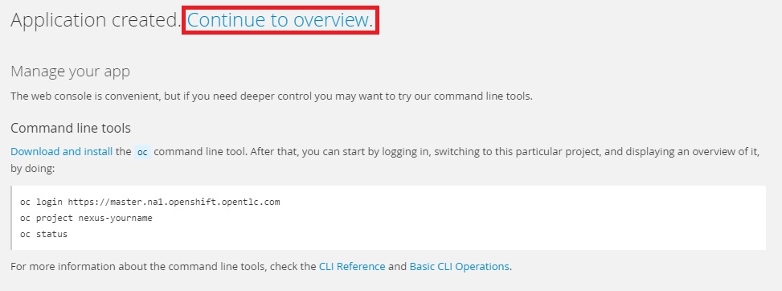
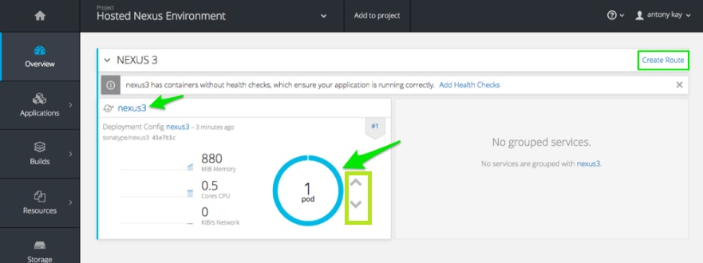
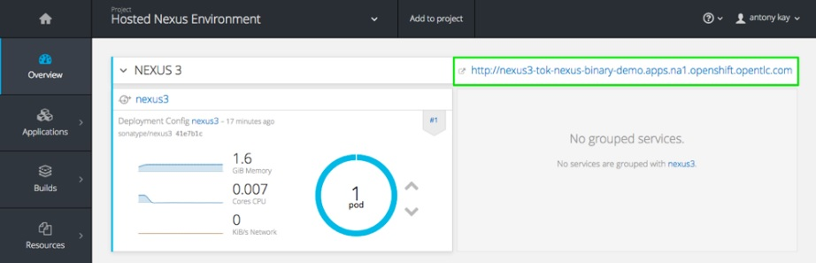
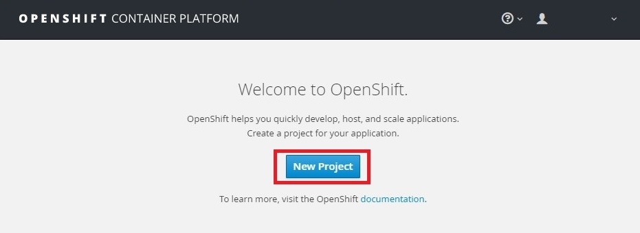
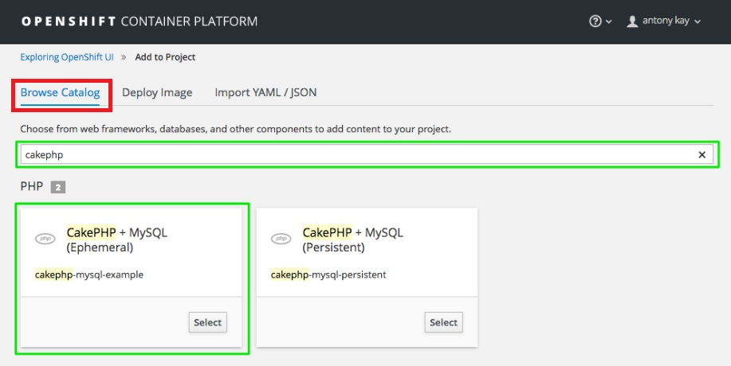
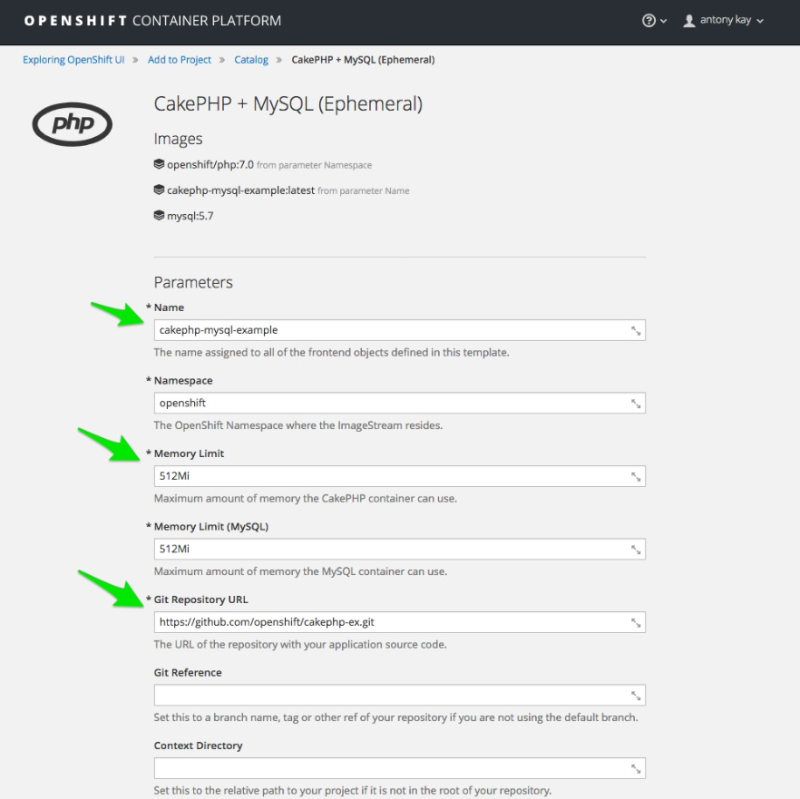
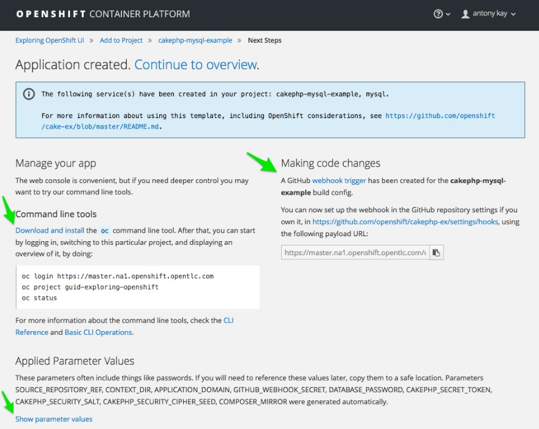
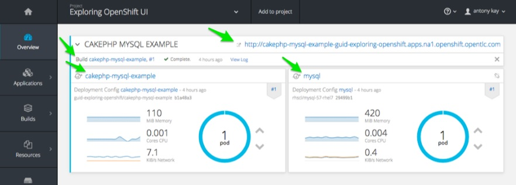
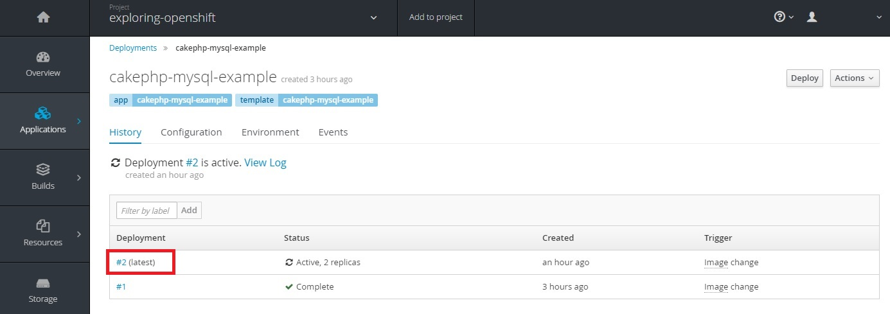

# 1.プロジェクト及びコンテナの作成と動作の確認

## 1-1.プロジェクトの作成
 OpenShiftは、”プロジェクト”というくくりで権限、アプリケーション等を管理しています。  
 アプリケーションを作成するにはまずプロジェクトを作成します。OpenShift のWebコンソールにログインし、"New Project" をクリックします。  
　※Webコンソールのアドレスについては別途ご確認ください。

　　

「Name」の欄に、"nexus-<your name>"を入力し、「Create」をクリックします。

※今回利用する環境はDemo環境で、利用者共有のシステムとなっています。OpenShiftでは、プロジェクト名は一意でなければなりません。プロジェクト名に名前を入れるのは、同一プロジェクト名での作成を避けるためです。

　

## 1-2.コンテナのデプロイメント
プロジェクト内にアプリケーションを作成してみます。  
「Deploy Image」をクリック。「Image Name」 欄に、”sonatype/nexus3”を入力の上、右端の🔍アイコンをクリックします。

　

　下方に画面をスクロールし、「Create」をクリックします。

※Sonatype が提供するDockerレポジトリからのコンテナ取得を行っています。また、詳細パラメータでは、コンテナに独自の構成情報を付加する「環境変数」と、リソースをグループ化し、アクセス制限など細かな制御を実現する「ラベル」をこちらの画面から設定することを確認します（今回は設定しません）。

「Continue to overview」をクリックします。

　

「Project」の「Overview」ページが開きます。「Nexus3」というサービスが作成され、Podが1つデプロイされていることが分かります。上下の矢印をクリックし、Podが増減することを確認します。コンテナをデプロイするだけでは外からの接続が行えません。そこで、「Create Route」をクリックし、「Nexus3」サービスに対するルートを作成します。

　
 
 ルート作成では、以下のようなオプションが設定可能です。（今回は指定しません）

HostName：
アプリケーションのDNS名を指定
（指定しない場合は自動で作成）
Path：
　サービスへの追加URL（サブディレクトリ）
Target Port：
　ネットワークポートの指定
Security：
　TLSターミネーションタイプの変更

 
 　
  
  サービスへのルートが作成されました。クリックしてみます。
  
 　

2-2-7.
Nexusリポジトリマネージャーが起動し、接続できることを確認します。サインインに関しては以下のアカウントが利用可能です。

admin/admin123

※サービスが完全に立ち上がるまでに少し時間がかかります。もし接続できないときは、少し時間をおいて確認してみましょう。

2-2-8.
動作が確認できたら、、ホームページに戻り、プロジェクトを削除します。

## 2.使用リソースの確認
　新しくアプリケーションをデプロイし、そのアプリケーションが使用しているCPUやメモリリソースについて確認してみましょう。

### 2-1.テンプレートの利用とリソースの確認
　まずはプロジェクトを作成します。

名前を入力し、「Create」をクリックします。

※名前はご自由に入力ください。但し、OpenShif内で一意である必要があります。

今度はテンプレートからデプロイしてみます。「Browse Catalog」をクリックし、"cakephp" を入力。
CakePHP +MySQL　の「Select」をクリックします。

サービス名、PHPとMySQLコンテナがそれぞれ利用可能な、最大メモリの値、アプリのソースコードが含まれるGitリポジトリが指定できることを確認します。

さらに、データベースのユーザーやパスワード等の設定やラベルをここで定義できることを確認します。指定しない場合は、自動的に作成されます。これらの値を作成して、フロントエンドのアプリケーションとバックエンドのデータベースのデプロイを行います。
一番下の「Create」をクリックし、デプロイを開始します。

oc コマンドツールのダウンロートサイトへのリンクや、webhookトリガーに簡単にアクセスできることを確認します。

Overviewページで以下を確認します。
・Podが二つデプロイされていること
・ルートが既に作成されていること
・Build状態を確認するためのリンク
・サービスへのリンク
さらに、レプリカの数の増減が出来ること、リソースの消費量が確認できます。

※リソースが表示されない場合は以下を確認しブラウザのアクセス制限を解除下さい。

「Applications」→「Pods」を選択。
「cakephp-xxxx...」をクリックし、「Metrics」をクリック
ブラウザのセキュリティを解除してください

### 2-2.サービスとビルドの確認
　今作成したアプリケーションに関するサービスとビルドについて詳細を確認してみましょう。
 「Application」→「Services」をクリック。

「mysql」サービスをクリック。

ルート、ポッドなどを確認することができます。

次に、ビルド情報を見てみます。
「Builds」→「Builds」を選択。ここにはプロジェクト内のすべてのビルド、及びそのステータス、ソースへのリンク、デプロイがいつ行われたかなどが表示されます。一通り確認が終了したら、「cakephp-xxxx...」をクリック。

右上の「Start Build」をクリックしてみましょう。
#2が追加されることが分かります。#1、#2をクリックして内容を確認してみます。

こちらは#1の表示例です。以下を確認します
・「Rebuild」のクリックで再ビルド実行可能
・ビルドのステータスとトリガー理由
・ソース情報
　など
「Logs」をクリックします。

ソースコードリポジトリがコンテナとしてダウンロードされていることが分かります。一番下の方を確認すると、完了したイメージがプロジェクト名を追加されてレジストリに追加されていることが分かります。

ソースコードリポジトリがコンテナとしてダウンロードされていることが分かります。一番下の方を確認すると、完了したイメージがプロジェクト名を追加されてレジストリに追加されていることが分かります。

ソースコードリポジトリがコンテナとしてダウンロードされていることが分かります。一番下の方を確認すると、完了したイメージがプロジェクト名を追加されてレジストリに追加されていることが分かります。

・デプロイに利用されたテンプレート情報
・ポート情報
・メモリ制限
・永続ボリュームが追加可能
などが確認できます。

また、パフォーマンスがしきい値をオーバーした際のオートスケール設定や、リソース使用量の制限も設定可能です。

「Environment」タブをクリックします。
デプロイ時に設定された環境変数が確認できます。環境変数はPod内で、ユーザー名やデータベース名など様々なパラメーターを設定することが可能で、また、ユーザー自身での追加も可能です。
確認が終了したら、「Events」タブをクリックします。

デプロイに関する様々なイベントを確認できます。一連の作業内容の確認や、デプロイの際のトラブルの確認などに利用可能です。

次に

  
7. リソースリミットの設定  
Deployments画面の右上の「Actions」プルダウンメニューから「Set Resource Limits」を選択。
222
