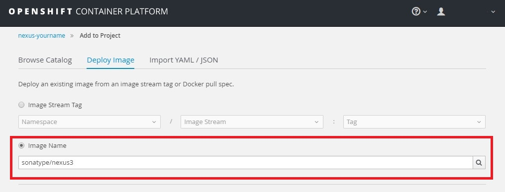

# 1.プロジェクト及びコンテナの作成と動作の確認

## 1-1.プロジェクトの作成
 OpenShiftは、”プロジェクト”というくくりで権限、アプリケーション等を管理しています。   
　アプリケーションを作成するにはまずプロジェクトを作成します。OpenShift のWebコンソールにログインし、"New Project" をクリックします。  
　※Webコンソールのアドレスについては別途ご確認ください。

　　

「Name」の欄に、"nexus-<your name>"を入力し、「Create」をクリックします。

※今回利用する環境はDemo環境で、利用者共有のシステムとなっています。OpenShiftでは、プロジェクト名は一意でなければなりません。プロジェクト名に名前を入れるのは、同一プロジェクト名での作成を避けるためです。

## 1-2.コンテナのデプロイメント
　「Deploy Image」をクリック。「Image Name」 欄に、
　”sonatype/nexus3”を入力の上、右端の🔍アイコンをクリックします。

　※Sonatype が提供するDockerレポジトリからのコンテナ取得を行います。

7. リソースリミットの設定  
Deployments画面の右上の「Actions」プルダウンメニューから「Set Resource Limits」を選択。
22
